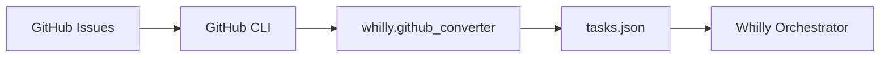

# 🤖 Whilly Workshop: Self-Writing Orchestrator

Демонстрация самопишущегося оркестратора, который автоматически выполняет задачи разработки из GitHub Issues.

## 🎯 Что мы делаем

1. **GitHub Issues → Whilly Tasks** — автоматическая конвертация
2. **Самоописание через PRD** — структурированные требования  
3. **Автоматическое выполнение** — оркестратор улучшает сам себя
4. **Pull Requests** — результаты в виде готового кода

## 🚀 Быстрый старт

### Вариант 1: Полная интеграция с автозакрытием Issues

```bash
./workshop_demo_with_integrations.sh
```

### Вариант 2: Базовый demo без интеграций

```bash
./workshop_demo.sh
```

### Вариант 3: Ручная настройка

```bash
# 1. Настроить интеграции (опционально)
export WHILLY_CLOSE_EXTERNAL_TASKS=true
export WHILLY_GITHUB_AUTO_CLOSE=true
export WHILLY_GITHUB_ADD_COMMENTS=true

# 2. Извлечь задачи из GitHub
python3 -m whilly --from-github workshop,whilly:ready

# 3. Запустить оркестратор с интеграциями
python3 -m whilly tasks-from-github.json

# 4. Issues автоматически закроются после выполнения! 🎉
```

## 📋 Что происходит внутри

### GitHub Issues → Tasks


### Структура задач
```json
{
  "id": "gh-1-add-contributing-badge",
  "description": "[workshop] Add CONTRIBUTING badge to README",
  "priority": "low",
  "key_files": ["README.md", "CONTRIBUTING.md"],
  "acceptance_criteria": [
    "README.md has a markdown badge linking to CONTRIBUTING.md",
    "Badge is placed after License badge"
  ],
  "github_issue": 1,
  "github_url": "https://github.com/mshegolev/whilly-orchestrator/issues/1"
}
```

## 🔗 External Integrations (NEW!)

### Автоматическое закрытие GitHub Issues
```
GitHub Issues → Whilly Tasks → Code → Commits → Comments → Closed Issues
```

**Что происходит:**
1. 🔧 Whilly выполняет задачу и создает коммит
2. 💬 Добавляет комментарий к GitHub Issue:
   ```
   🤖 Whilly Task Completed
   - Task ID: gh-1-add-contributing-badge  
   - Status: ✅ Completed successfully
   - Commit: f04ebb1a
   ```
3. ❌ Закрывает Issue с reason "completed"

### Настройка интеграций
```bash
# GitHub (автоматически если gh auth)
export WHILLY_GITHUB_AUTO_CLOSE=true
export WHILLY_GITHUB_ADD_COMMENTS=true

# Jira (опционально)  
export WHILLY_JIRA_ENABLED=true
export WHILLY_JIRA_SERVER_URL="https://company.atlassian.net"
export JIRA_API_TOKEN="your_token"
```

**📋 Подробнее:** [docs/EXTERNAL_INTEGRATIONS.md](docs/EXTERNAL_INTEGRATIONS.md)

## 🛠️ Созданные компоненты

### 1. GitHub Converter (`whilly/github_converter.py`)
- Извлекает Issues через GitHub CLI
- Конвертирует в формат Whilly tasks
- Автоматически определяет приоритеты, key_files
- Извлекает acceptance_criteria из описаний

### 2. CLI Integration
- `--from-github [labels]` — новая опция в CLI
- Интеграция с существующим workflow
- Интерактивный режим запуска

### 3. PRD System
- Системный промпт для PRD мастера
- Автоматическая генерация PRD из описаний
- Связь GitHub Issues ↔ PRD ↔ Tasks

## 📊 Workshop Tasks

Текущие задачи из Issues с тегом `workshop`:

1. **gh-1-add-contributing-badge** — Add CONTRIBUTING badge
2. **gh-2-add-tests-init** — Add tests/__init__.py  
3. **gh-3-add-troubleshooting** — Add TROUBLESHOOTING section
4. **gh-4-add-scripts-helper** — Add scripts/show_costs.sh
5. **gh-5-pin-ruff-dependency** — Pin ruff dependency  
6. **gh-7-x** — TBD task

## 🎥 Demo Flow

```bash
# 1. Show current Issues
gh issue list --label workshop

# 2. Convert to tasks
python3 -m whilly --from-github

# 3. Show generated tasks
jq '.tasks[].description' tasks-from-github.json

# 4. Run orchestrator
python3 -m whilly tasks-from-github.json

# 5. Watch magic happen! ✨
```

## 🧠 Architecture Insights

**Self-Improvement Loop:**
```
GitHub Issues → PRD → Tasks → Whilly → Code → PRs → Merge → Better Whilly
```

**Key Innovation:**
- **Auto-extraction** из GitHub ecosystem  
- **Интеллектуальная конвертация** Issues → структурированные задачи
- **Немедленное выполнение** без ручного вмешательства

## 🎓 Takeaways

1. **GitHub Integration** — AI может работать прямо с вашим workflow
2. **Auto-planning** — от Issue до готового кода автоматически
3. **Self-improvement** — система улучшает сама себя
4. **Production-ready** — реальные PRs, настоящие улучшения

---

**Результат:** Whilly становится умнее с каждой выполненной задачей! 🚀