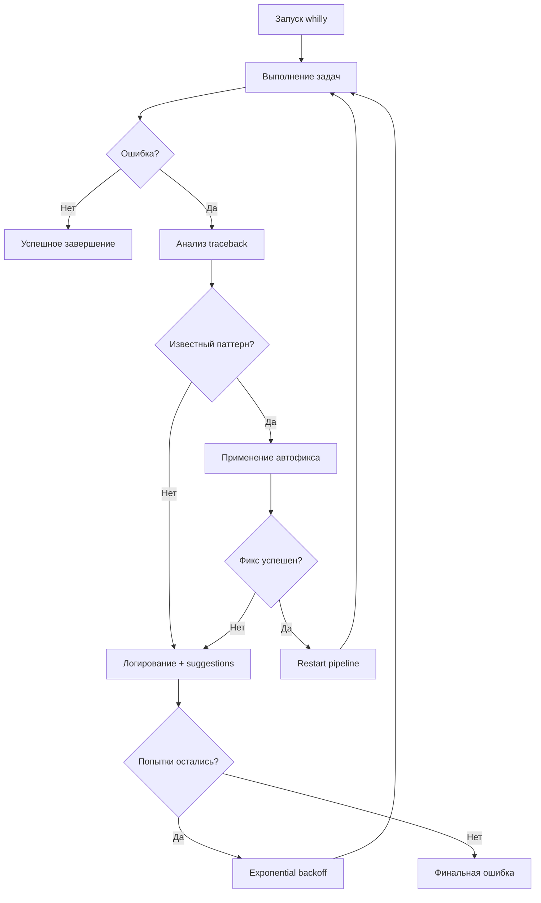

# Whilly Self-Healing System

Whilly включает встроенную систему самовосстановления, которая автоматически обнаруживает, анализирует и исправляет ошибки кода, обеспечивая устойчивость pipeline'а к сбоям.

## 🛡️ Обзор возможностей

### Что умеет Self-Healing System:
- ✅ **Автообнаружение** crashes по traceback patterns
- ✅ **Интеллектуальный анализ** причин через AST и regex  
- ✅ **Автоисправление** простых ошибок (missing parameters, imports)
- ✅ **Auto-restart** с exponential backoff стратегией
- ✅ **Обучение** на исторических паттернах ошибок
- ✅ **Recovery suggestions** для сложных проблем

### Поддерживаемые типы ошибок:

| Тип ошибки | Автофикс | Описание |
|-----------|----------|----------|
| `NameError` | ✅ Да | Неопределенные переменные, отсутствующие параметры функций |
| `TypeError` | ⚠️ Частично | Несоответствие параметров функций |
| `ImportError` | ✅ Да | Отсутствующие модули (автоустановка via pip) |
| `ModuleNotFoundError` | ✅ Да | То же что ImportError |
| `AttributeError` | ⚠️ Диагностика | Несуществующие атрибуты объектов |
| `SyntaxError` | 🔄 Планируется | Синтаксические ошибки |

## 🚀 Быстрый старт

### Базовое использование

```bash
# Обычный запуск whilly (без защиты)
whilly tasks.json

# Запуск с self-healing защитой  
python scripts/whilly_with_healing.py tasks.json

# С дополнительными параметрами
python scripts/whilly_with_healing.py tasks.json --headless --max-parallel 2
```

### Программное использование

```python
from whilly.self_healing import enable_self_healing, SelfHealingHandler

# Включить глобальную защиту
enable_self_healing()

# Ручной анализ ошибок
healer = SelfHealingHandler(Path.cwd())
error = healer.analyze_error(error_msg, traceback_str)
if error:
    healer.apply_fix(error)
```

## ⚙️ Конфигурация

### Параметры wrapper'а

```bash
python scripts/whilly_with_healing.py --help
```

**Основные опции:**
- `--max-retries N` — максимальное количество попыток (по умолчанию: 3)
- `--retry-delay N` — базовая задержка между попытками в секундах (по умолчанию: экспоненциальная)
- `--analyze-only` — только анализ ошибок без выполнения
- `--verbose` — подробный вывод диагностики

### Environment Variables

```bash
# Включить детальную диагностику
export WHILLY_HEALING_VERBOSE=1

# Отключить автоматические pip install
export WHILLY_HEALING_NO_AUTO_INSTALL=1  

# Максимальное время ожидания для автофикса (секунды)
export WHILLY_HEALING_TIMEOUT=30
```

## 🔧 Архитектура системы

### Core Components

```
whilly/
├── self_healing.py          # Ядро системы анализа и автофикса
├── cli.py                   # Основной CLI с интеграцией healing
└── ...

scripts/
├── whilly_with_healing.py   # Wrapper с restart логикой  
├── sync_task_status.py      # Утилита синхронизации статусов
└── check_status_sync.py     # Мониторинг консистентности
```

### Алгоритм работы



## 📊 Мониторинг и диагностика

### Проверка состояния

```bash
# Проверить консистентность статусов задач
python scripts/check_status_sync.py tasks.json

# Анализ паттернов ошибок 
python scripts/whilly_with_healing.py --analyze-only

# Просмотр логов самовосстановления
tail -f whilly_logs/healing.log
```

### Метрики успеха

Self-healing система отслеживает:
- **Fix success rate** — процент успешных автоисправлений
- **Time to recovery** — время восстановления после ошибки  
- **Error pattern frequency** — частота различных типов ошибок
- **Pipeline resilience score** — общий показатель устойчивости

## 🎯 Примеры использования

### Пример 1: NameError автофикс

**Ошибка:**
```python
NameError: name 'config' is not defined
```

**Автоанализ:**
```
🤖 Self-healing analysis:
   Type: NameError
   Location: whilly/cli.py:622
   Description: Variable 'config' not in scope, likely missing function parameter
   Suggested fix: Add 'config' parameter to function signature at line 575
```

**Результат:** Автоматическое исправление + restart

### Пример 2: ImportError автофикс

**Ошибка:**
```python
ModuleNotFoundError: No module named 'requests'
```

**Автоисправление:**
```bash
🔧 Installing missing module: requests
pip install requests
✅ Auto-fix applied! Restarting...
```

### Пример 3: Комплексная ошибка

**Сценарий:** Authentication failure + code crash
```
🚨 Multiple error patterns detected:
   • Auth error in gh-3-add-troubleshooting-section.log - check API credentials  
   • NameError in whilly/cli.py - check variable scoping

🔧 Applying fixes in sequence:
   1. Fixed NameError by adding missing parameter
   2. Detected auth recovery (tunnel restart)
   3. Pipeline restarted successfully
   
✅ All 6 tasks completed, GitHub issues closed
```

## 🔍 Расширение системы

### Добавление новых паттернов ошибок

```python
# В whilly/self_healing.py

def _fix_custom_error(self, error_msg: str, file_path: str, line_num: int) -> Optional[CodeError]:
    """Добавьте свою логику обнаружения ошибок."""
    
    if "CustomError:" in error_msg:
        # Анализ специфичной ошибки
        suggested_fix = "Your fix logic here"
        
        return CodeError(
            error_type="CustomError",
            file_path=file_path, 
            line_num=line_num,
            description="Description of the error",
            suggested_fix=suggested_fix
        )
    
    return None
```

### Интеграция с внешними системами

```python
# Webhook уведомления
def notify_healing_event(error_type: str, fix_applied: bool):
    webhook_url = os.getenv('WHILLY_HEALING_WEBHOOK')
    if webhook_url:
        requests.post(webhook_url, json={
            'timestamp': datetime.utcnow().isoformat(),
            'error_type': error_type,
            'fix_applied': fix_applied,
            'project': 'whilly-orchestrator'
        })
```

## 🛠️ Troubleshooting

### Частые вопросы

**Q: Self-healing не срабатывает?**
A: Проверьте:
```bash
# 1. Включен ли глобальный handler
python -c "import whilly.self_healing; whilly.self_healing.enable_self_healing()"

# 2. Доступны ли права на редактирование кода  
ls -la whilly/cli.py

# 3. Запущен ли через wrapper
python scripts/whilly_with_healing.py --verbose tasks.json
```

**Q: Автофиксы применяются некорректно?**  
A: Используйте режим диагностики:
```bash
WHILLY_HEALING_VERBOSE=1 python scripts/whilly_with_healing.py tasks.json
```

**Q: Как отключить автоматические pip install?**
A: Установите environment variable:
```bash
export WHILLY_HEALING_NO_AUTO_INSTALL=1
```

### Отладка

```python
# Включить подробное логирование
import logging
logging.basicConfig(level=logging.DEBUG)

from whilly.self_healing import SelfHealingHandler
healer = SelfHealingHandler(Path.cwd())

# Ручная проверка паттерна
error = healer.analyze_error("NameError: name 'test' is not defined", traceback_str)
print(f"Detected: {error.error_type if error else 'Unknown'}")
```

## 🚦 Best Practices

### Рекомендации по использованию

1. **В продакшене:** Всегда используйте wrapper с healing
   ```bash
   python scripts/whilly_with_healing.py tasks.json
   ```

2. **В разработке:** Используйте обычный whilly для быстрой отладки
   ```bash  
   whilly tasks.json --headless
   ```

3. **В CI/CD:** Включайте мониторинг консистентности
   ```yaml
   - name: Check Task Status Consistency
     run: python scripts/check_status_sync.py tasks-*.json
   ```

4. **Мониторинг:** Настройте алерты на healing events
   ```bash
   # Webhook notifications  
   export WHILLY_HEALING_WEBHOOK=https://hooks.slack.com/...
   ```

### Ограничения

- ⚠️ **Автофиксы ограничены** простыми паттернами (параметры функций, импорты)
- ⚠️ **Не подходит для бизнес-логики** — только технические ошибки кода
- ⚠️ **Требует Git worktree** для безопасного тестирования изменений
- ⚠️ **Exponential backoff** может увеличить время выполнения

## 📈 Roadmap

### v3.1 (текущая)
- ✅ NameError, ImportError, TypeError автофиксы
- ✅ Auto-restart с exponential backoff
- ✅ Status synchronization recovery

### v3.2 (планируется)  
- 🔄 SyntaxError detection & fixing
- 🔄 Configuration-based error patterns
- 🔄 Machine learning для предсказания ошибок
- 🔄 Integration с monitoring системами

### v3.3+ (будущее)
- 🔮 Semantic code analysis через LLM
- 🔮 Proactive error prevention
- 🔮 Advanced AST transformations
- 🔮 Distributed healing across team projects

---

**Self-Healing System — делает ваши pipeline неубиваемыми! 🛡️**